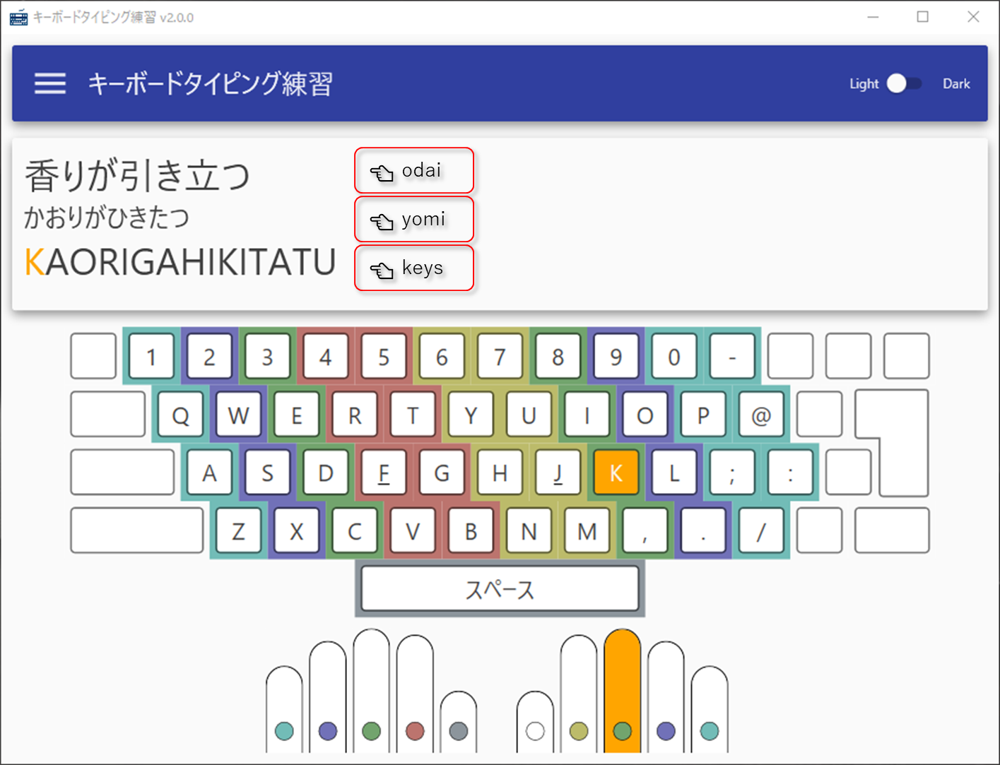
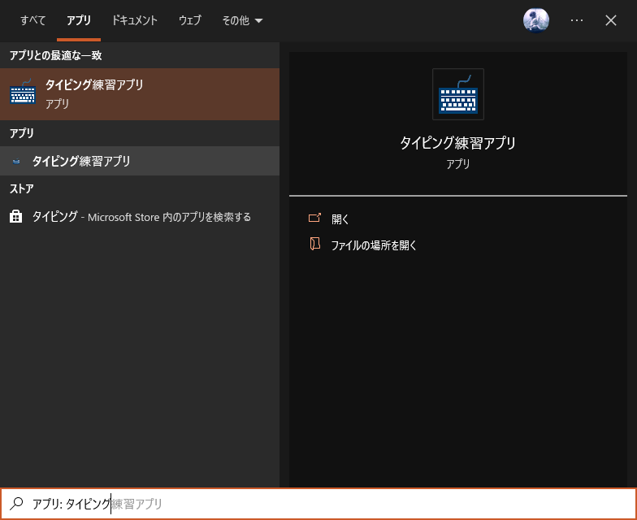

# ⌨️ TypingPractice

⌨️ TypingPractice: This application allows you to practice typing on a Japanese keyboard offline.

⌨️ タイピング練習: このアプリケーションは、オフラインで日本語キーボードのタイピングを練習することができます。

## デモ


## インストール

[ここ](https://github.com/FullAmigo/TypingPractice/releases/latest)から `TypingPracticeSetup.msi` をダウンロードしてください。

## お題ファイルの準備

タイピング練習のアプリは、お題ファイル `Exercises.json` の内容をもとに動作します。

お題ファイルは、アプリをインストールした場所（通常は `C:\Program Files (x86)\FullAmigo\タイピング練習アプリ`）に保存されているので、このファイルの内容をメモ帳などで編集し上書き保存します。

```json
[
  {
    "odai": "あいうえお",
    "yomi": "あいうえお",
    "keys": "aiueo"
  },
  {
    "odai": "香りが引き立つ",
    "yomi": "かおりがひきたつ",
    "keys": "kaorigahikitatu"
  }
]
```

以下は、お題ファイルの設定項目と画面との対応です。



## アプリの起動

デスクトップのショートカットより起動するか、またはアプリを `タイピング練習アプリ` で検索したものを起動してください。



